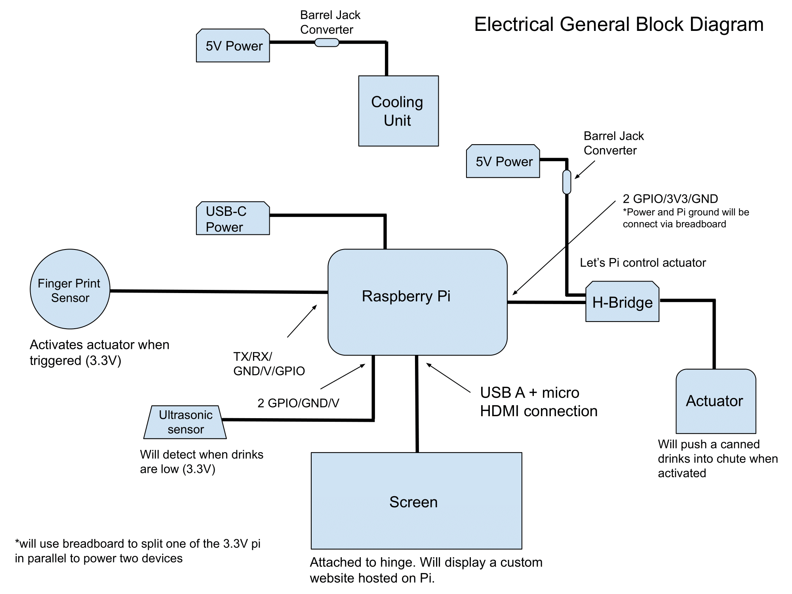
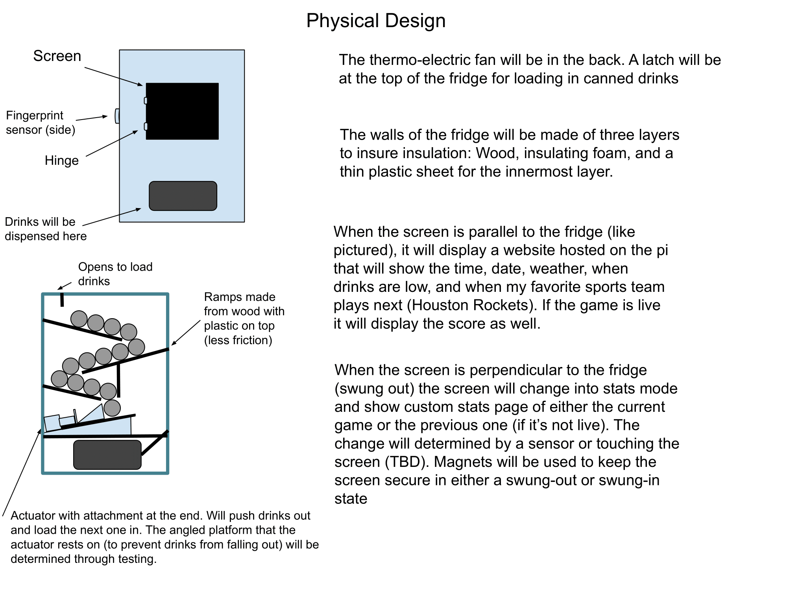

## Members
Nate Janney, Electrical Engineering Student (2025)
natej24@vt.edu

## Mentor
Matthew Scala

## Current Status
IN PROGRESS

## Project Overview
A custom smart fridge with a touch-screen display which will showcase daily overviews along with 
live sports information with a swing-out screen

## Educational Value Added
I will learn how to use a rasberry pi,
strengthen my python skills, create a full embedded system and combine different skillsets to create one cohesive unit. 

## Tasks

<!-- Your Text Here. You may work with your mentor on this later when they are assigned -->

## Design Decisions

Design Block Diagrams + Descriptions
Link for two diagrams one for the physical design the other for the electrical design.

## Design Misc

<!-- Your Text Here. You may work with your mentor on this later when they are assigned -->

## Steps for Documenting Your Design Process

<!-- Your Text Here. You may work with your mentor on this later when they are assigned -->

## BOM + Component Cost

<!-- Your Text Here. You may work with your mentor on this later when they are assigned -->

## Timeline

<!-- Your Text Here. You may work with your mentor on this later when they are assigned -->

## Useful Links

<!-- Your Text Here. You may work with your mentor on this later when they are assigned -->

## Log

<!-- Your Text Here. You may work with your mentor on this later when they are assigned -->
